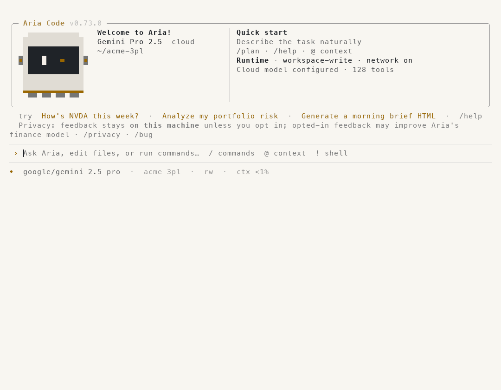

<p align="center">
  <picture>
    <source media="(prefers-color-scheme: dark)" srcset="docs/assets/aria-code-icon.png">
    
  </picture>
</p>

<h1 align="center">Aria Code</h1>

<p align="center">写代码、做金融分析、管物流运营的开源 AI 助手。<br>
数字算给你看，客户数据分开管，要花钱的动作由人来批。</p>

<p align="center">简体中文 · <a href="README.md">English</a></p>

<p align="center">
  <a href="https://www.npmjs.com/package/@artheras/aria-code"></a>
  <!-- Release automation pins PyPI: the default endpoint still selects legacy 4.x. -->
  <a href="https://pypi.org/project/aria-code/0.110.0/"></a>
  <a href="https://github.com/artheras/aria-code/actions/workflows/ci.yml"></a>
  <a href="LICENSE"></a>
</p>

<p align="center"></p>
<p align="center"><sub>真实会话，模型为 Gemini 2.5 Pro（Vertex AI）：Aria 编写 <code>fx.py</code> 和测试，每一步经你批准后运行测试，随后 <code>/review</code> 审查这次改动并给出结论。仅缩短了等待时间，其余未做改动。<a href="docs/assets/demo-coding.png">静态截图</a> · <a href="scripts/record_demo.py">录制脚本</a> · <a href="scripts/render_demo.py">渲染脚本</a></sub></p>

## Aria Code 能做什么

**写代码、做项目。** 用大白话描述任务。Aria 读懂项目、编写和修改文件、运行命令和测试，每一处改动落地前都先给你看——你点头之前什么都不会写入、不会执行。[`/review`](docs/code-review.md) 像一位细心的同事那样审查改动：按 P0–P3 排序的问题，标明文件和行号，并给出结论；`aria-code review --base main --fail-on P1` 可以在 CI 里把关合并请求。可用本地 Ollama 模型、Google Cloud 上的 Gemini（Vertex AI，只需 `gcloud` 登录）或其他受支持的服务商。

**做金融和财务分析。** 行情、技术指标、带 HTML 报告的回测、风险与因子分析、SEC 公告，以及美股、港股、A 股和加密货币数据。结果写明数据来源、区间和缺口。

<p align="center"></p>

**管物流运营。** 面向第三方物流：补货点、安全库存、ABC/XYZ 分类、呆滞库存、承运商评分和运费异常；在飞书里，每个货主每天一份简报，附带审批卡片。

<p align="center"></p>
<p align="center"><sub>两段都录自真实会话——行情来自 yfinance；物流数据是 <code>evals/fixtures</code> 中的示例 3PL 数据，不调用模型。</sub></p>

## 它怎么工作

通用 AI 追求的是答得像样；代码、行情和仓库里的结果是要拿去执行的——货币函数里的一条舍入规则，补货时漏算的一张在途采购单。由此有三条规则：

**数字算给你看。** 补货点、安全库存、承运商排名和回测都来自公开公式和注明来源的数据，结果里写明公式和每一条假设；可安装的 [Artheras skills](https://github.com/artheras/skills) 里的稳定币结算对账也是如此。数据撑不起结论时——需求历史不足 14 天、数据行没有标明货主——它会直接说明，而不是估一个数。[`operations` 评测套件](docs/verifiable-evals.md)专门检验这些陷阱。

**客户数据分开管。** 第三方物流（3PL）同时保管很多货主的库存。一个群绑定一个货主后，所有分析都只针对这个货主；物流工具本身会拒绝别家货主的数据和无法归属的文件——这条规则在提示词之下执行，不依赖模型自觉。

**要花钱的动作由人来批。** 在终端里，每次写文件、每条命令都等你点头，改动的差异就摆在眼前。在飞书里，`/补货` 会把补货清单变成一张采购单草稿审批卡片；审批人点「批准」之前什么都不会发生，执行的正是卡片上展示的内容。草稿是交给你们自己采购系统的文件——Aria Code 不会自动下单。

新安装不带任何实时业务数据：物流工具读取你们导出的 CSV 或 JSON，行情来自公开数据源，聊天功能需要飞书应用或 Aria 中继。

## 快速开始

macOS 和 Linux 可直接安装独立 CLI，无需预装 Python、Node.js 或 npm：

```bash
curl -fsSL https://raw.githubusercontent.com/artheras/aria-code/main/scripts/install.sh | sh
~/.local/bin/aria
```

Windows x64 请在 PowerShell 中运行：

```powershell
irm https://raw.githubusercontent.com/artheras/aria-code/main/scripts/install.ps1 | iex
aria
```

安装脚本从最新的 [GitHub Release](https://github.com/artheras/aria-code/releases/latest) 下载对应平台的二进制文件，校验 SHA-256 后安装到当前用户目录。重新打开终端后，可用 `aria`、`aria code` 或 `aria-code` 打开交互界面。设置 `ARIA_CODE_VERSION=v0.55.0` 可固定版本。

也可以选择包管理器：`npm install -g @artheras/aria-code`（需要 npm），或 `python3 -m pip install --upgrade "aria-code<4"`（需要 Python 3.10+；`<4` 用来跳过 PyPI 上仍保留的旧 4.x 版本号）。源码开发方式见 [CONTRIBUTING.md](CONTRIBUTING.md)。

### 更新

Aria 启动时会在后台自动检查稳定版本，每天最多检查一次。已有的更新提醒立即显示，网络检查不会阻塞输入。版本来自 GitHub Releases；npm 安装使用 `@artheras/aria-code`。pip 更新会固定 GitHub 版本并确认该版本已在 PyPI 发布，避免误装 PyPI 仍标为最新版的旧 4.x 系列。源码安装会显示 Git 更新指引。

```bash
aria update --check  # 只检查，不安装
aria update          # 按当前安装方式更新到最新稳定版本
aria update --to 0.110.0  # 安装指定稳定版本
aria update --rollback   # macOS/Linux 独立安装：离线恢复上一个受管理版本
```

交互界面内可用 `/update --check` 或 `/update`，更新后重新启动 Aria。独立安装先验证 SHA-256 和下载程序的版本，再切换启动命令；下载或校验失败会保留原命令。启动检查只提醒，不会自动替换程序。要关闭启动检查，可将 `~/.aria-code/config.json` 中的 `check_for_update_on_startup` 设为 `false`。

也可打开[本仓库](https://github.com/artheras/aria-code)，选择 **Watch → Custom → Releases** 并保存，GitHub 会按你的通知设置提醒发布。所有平台安装包及包管理器发布完成后，稳定版本会出现在[发布页面](https://github.com/artheras/aria-code/releases/latest)。

macOS/Linux 独立安装的更新器会保留中断下载；GitHub 下载失败时，可自动尝试同版本的官方 npm 平台包并校验完整性。用 `aria health --model --tools --json` 可验证当前模型的文本输出和工具调用。详见[更新、恢复及模型诊断](docs/update-and-model-diagnostics.md)。

使用本地模型时，先安装 [Ollama](https://ollama.com/download)，拉取一个编码模型，再以仅本地模式启动：

```bash
ollama pull qwen2.5-coder:7b
aria-code --local
```

也可以在现有项目中执行单次任务：

```bash
aria-code -p "检查这个项目，修复失败的测试，运行测试并总结代码差异。"
```

Aria 会根据所配置的权限模式，在编辑文件或运行命令前请求批准。提交代码前请检查改动和测试结果。

在脚本或 CI 中，`--json` 输出一份 JSON 结果，`--format jsonl` 在运行过程中每一步输出一行 JSON 事件（`turn.started`、`tool.started`、`tool.completed`、`turn.completed`）。stdout 只有 JSON，失败时退出码为 1。无人审批时，用 `--allow-tools edit_file,run_command` 指定允许使用的工具。

```bash
aria-code -p "修复失败的测试并运行" --format jsonl --allow-tools edit_file,run_command > events.jsonl
```

## 模型与账户

| 使用方式 | 需要准备 |
| --- | --- |
| 本地 Ollama | 已安装并运行的 Ollama 模型；本地推理无需云端账户。 |
| 直接连接云端供应商 | 对应供应商的 API 凭证和网络连接。 |
| 直接连接 Google Cloud Vertex AI | `GOOGLE_CLOUD_PROJECT`，外加 `gcloud auth login` 登录（Aria 用该登录的令牌访问 Vertex AI 的 OpenAI 兼容端点），或安装 `aria-code[google]` 并配置应用默认凭证。`GOOGLE_CLOUD_LOCATION` 默认为 `global`。项目可用的模型都无需 API key：`/model google/gemini-3.5-flash`、Gemini 3 预览版（仅在 `global` 提供），以及 Gemma 等 Model Garden 托管模型（`/model google/<模型 ID>`，经 Vertex 的 OpenAI 兼容端点调用）。 |
| Arthera 托管服务 | 安装 `aria-code[google]`，然后在 CLI 中使用 `/login` 登录。Arthera 账户登录不会自动给本机授予 Vertex AI 凭证。 |

只安装所需功能的可选依赖；当前安装选项以 [pyproject.toml](pyproject.toml) 为准。本地推理可以离线运行，但实时行情、远程集成、登录和云端模型不能离线使用。

## 继续了解

| 主题 | 文档 |
| --- | --- |
| 架构与运行时 | [架构](docs/architecture.md) |
| 工具权限与数据边界 | [安全说明](docs/aria-code-safety.md) |
| 仓储智能体及只读数据契约 | [仓储 ERP 智能体](docs/warehouse-erp-agents.md) |
| 策略与回测流程 | [策略工作台](docs/strategy_workspace.md) |
| 更多示例 | [示例](examples/README.md) |
| 版本变化 | [更新日志](CHANGELOG.md) |

当前命令行参数请运行 `aria-code --help`；交互会话内可运行 `/help`。这比在 README 中复制一份容易过时的完整命令清单更可靠。

## 参与贡献与许可

欢迎参与贡献，见 [CONTRIBUTING.md](CONTRIBUTING.md)。Aria Code 以 [Apache License 2.0](LICENSE) 开源。

4.2.0 到 4.4.5 这些版本发布时使用的是 Business Source License 1.1，它们仍然按那份许可证的条款提供；4.1.2 及更早的版本是 MIT。已经授予出去的许可无法收回，所以每个版本都保留它发布时所用的许可证 —— 见 [NOTICE](NOTICE)。
