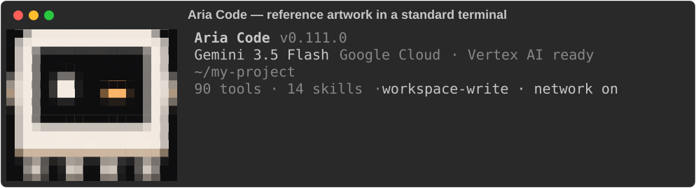

# Terminal artwork and project verification

The startup robot uses the original `aria-robot.png` reference. The wheel and
native binaries both include that file. In iTerm2, Kitty and Ghostty, a real
terminal can display the cropped PNG without resampling its pixels. Other
colour terminals use a 20 × 18 pixel sample rendered with half-block cells.
That is a terminal approximation, not the full-resolution image. Apple
Terminal supports this fallback rather than inline PNG graphics.

`ARIA_ROBOT_RENDER` accepts `auto` (default), `image`, `pixels`, `compact` and
`off`. Narrow terminals, redirected output and no-colour consoles retain the
compact silhouette. In tmux and screen, Aria falls back to cells. The image
occupies reserved rows; update notices and the prompt appear underneath it.

## Background commands

Stopping a background command checks its whole owned process group, including
children whose parent has exited. POSIX commands get TERM followed by KILL if
needed; Linux zombies are no longer treated as executing processes. Windows
commands start suspended, enter an owned Job Object, then resume. Stopping or
closing the job terminates its descendants. Repeated stops are safe.

## Command confinement

macOS uses Seatbelt. Linux uses bubblewrap when installed, with writable mounts
for the permitted workspace/output/temp roots and a separate network namespace
when networking is off. Sandbox launch failures are returned to the caller;
commands are not retried outside the sandbox. `aria doctor` reports the available
implementation. Windows and Linux without bubblewrap currently apply command
policy without OS filesystem/network confinement. Windows Job Objects manage
process lifetime and do not provide that confinement.

## Local tools and project checks

Opt-in backend local execution requires the `aria-local-v1` acknowledgement.
The client preserves the assistant's tool-call IDs and matching results across
HTTP requests, including parallel batches crossing the history cutoff. A real
HTTP round-trip test performs a local file read and passes its result back to
the backend. This does not establish that every production backend supports
the protocol; direct Vertex AI tool execution remains independently supported.

Verification now recognizes standard-library unittest projects instead of
requiring pytest for every `tests/` directory. Explicit pytest configuration
and mixed suites still use pytest. The `projects` eval suite tests a complete
CLI feature, validation, Unicode output, documentation and the no-third-party
dependency rule. CI checks that its starting fixture fails, and the existing
weekly Vertex AI eval workflow runs the actual agent against it. Timed-out
evals retain partial tool events and diagnostics and remain unscored errors.
